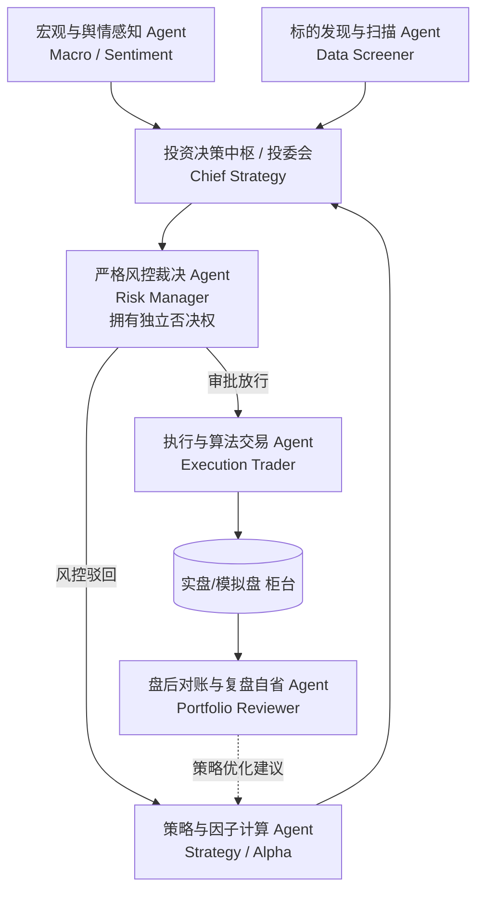

# MultiAgent 量化交易系统现状与演进路线图

本文档详细梳理了当前 **MultiAgent** 智能体系统的技术底座、已实现的核心能力，并规划了未来逐步演化升级为**由多 Agent 协同驱动的工业级量化交易系统**的完整蓝图。

---

## 一、 当前系统已实现架构与核心能力

当前项目已基于 **LangChain 1.4+ / LangGraph** 构建了全栈解耦的智能体运行时架构，核心遵循 **“Agent = Model + Harness”** 与 **“代码与资产解耦”** 的理念。

```text
MultiAgent/
├── backend/                  # 【后端引擎源码】（纯代码逻辑，无状态设计）
│   ├── core/                 # 底层通用 Agent 运行时引擎
│   │   ├── builder.py        # LangGraph 图编译、统一门面 StandaloneAgent、审批恢复
│   │   ├── config.py         # 智能体参数契约模型 (自适应环境变量)
│   │   ├── model.py          # 统一大模型工厂 (OpenAI / DeepSeek / 兼容端点)
│   │   ├── sandbox.py        # 独立代码沙箱 (子进程 Python 执行、文件隔离读写)
│   │   ├── security.py       # 安全审批围栏 (敏感工具拦截、动态白名单、HIL)
│   │   ├── context_compression.py # 智能上下文压缩 (5级压缩策略、Token预算)
│   │   ├── session_manager.py# 会话持久化管理器 (SQLite Checkpoint、标题生成)
│   │   └── tools.py          # 通用系统工具
│   ├── agents/               # 智能体模板/工作区解析与加载模块
│   │   └── loader.py         # 自动扫描 workspace/agents/ 动态装配、MCP安全拦截
│   ├── chat_cli.py           # 交互式终端对话器 (CLI Chat 完整交互引擎)
│   └── main.py               # 自动化执行流水线/演示入口
│
├── workspace/                # 【用户资产工作区】（与后端代码物理解耦）
│   ├── agents/               # 声明式智能体目录
│   │   ├── data_scraper/     # 金融数据抓取 Agent (对接同花顺 Fuyao MCP 行情服务)
│   │   └── data_analyst/     # 量化走势分析 Agent (量化指标计算、挂载独立代码沙箱)
│   ├── data/                 # 业务数据存放区 (K线历史 JSON 等)
│   ├── sandboxes/            # Agent 运行期专属隔离空间 (研报输出、图表生成)
│   └── sessions.db           # SQLite 集中式多会话持久化数据库
│
├── chat.py                   # 根目录 CLI 快捷启动入口
└── pyproject.toml            # 项目依赖管理
```

### 核心亮点能力清单

1. **声明式资产模板与 MCP 集成**：
   * 采用 `agent.yaml` + `prompt.md` + `skills/` + `tools.py` 结构定义独立 Agent。
   * 原生打通 Model Context Protocol (MCP)，内置 `SafeMCPToolCallInterceptor`，解决外部金融行情服务在休市日返回 `null` 与 Schema 冲突的异常。
2. **三层 LangChain 原生中间件栈**：
   * **安全围栏中间件 (`ToolApprovalPolicy` / `HumanInTheLoopMiddleware`)**：拦截敏感工具（代码执行、写文件等），支持中断挂起（Interrupt）与多策略审批决策（批准、拒绝、加入会话白名单不再询问）。
   * **智能上下文压缩中间件 (`ContextCompressionMiddleware`)**：滑动窗口 + 工具长文本折叠 + 大模型摘要浓缩 + Token 预算组合拳，根除长文本溢出。
   * **任务待办看板中间件 (`TodoListMiddleware`)**：让 Agent 自主规划多步骤长任务，提供任务推进的可见性。
3. **隔离代码沙箱引擎 (`AgentSandbox`)**：
   * 将 Agent 代码执行限制在独立子进程与 `workspace/sandboxes/<AgentName>/` 路径下，隔离执行超时，研报与图表持久化。
4. **集中持久化会话记忆 (`SessionManager`)**：
   * 基于 `langgraph-checkpoint-sqlite` 实现命名空间隔离（`agent_name:session_id`），支持首轮对话自动提炼精炼会话标题。
5. **沉浸式交互终端 (`chat_cli.py` & `chat.py`)**：
   * 支持 `/new`、`/sessions`、`/switch`、`/agent`、`/todos`、`/history` 等斜杠管理指令。
   * 提供 ReAct 工具调用动态感知动画、流式更新与人机审批直接交互。

---

## 二、 升级量化交易系统的演进蓝图

要从当前的“分析工具”演进为**具备自主决策与执行能力的量化交易系统**，需要在以下五个维度构建闭环：

### 1. 多智能体拓扑与职能专业化（Multi-Agent System）

在 LangGraph 状态图之上，将单智能体拆分为协同作战的专业委员会：



* **标的扫描 Agent (Screener Agent)**：全市场扫描（涨跌停池、突破形态、龙虎榜异动、主力资金流向）。
* **策略因子 Agent (Strategy Agent)**：编写动量策略、均值回归、网格策略或经典量化指标计算。
* **风控裁决 Agent (Risk Manager Agent)**：具有一票否决权，严控单一持仓上限、单日最大回撤熔断。
* **算法交易 Agent (Execution Agent)**：TWAP / VWAP 拆单、防滑点挂单与撤单执行。
* **复盘反思 Agent (Critic / Reviewer Agent)**：盘后拉取交割单，计算年化收益、最大回撤、夏普比率，反馈策略弱点。

---

### 2. 自动化与调度生命周期（参考 OpenClaw 自动化模型）

结合量化市场的严密时间节律，引入多层次驱动机制：

| 时间节点 | 调度机制 | 核心业务动作 |
| :--- | :--- | :--- |
| **08:45 (盘前)** | **Cron 精确定时任务** | 抓取隔夜外盘、宏观政策与公司公告，输出今日重点关注池（Watchlist）。 |
| **09:15 - 09:25** | **Cron 任务** | 监控集合竞价异动、开盘跳空缺口，向投委会汇报开盘情绪。 |
| **09:30 - 15:00 (盘中)** | **Heartbeat (心跳巡检) / 实时流** | 每 1~5 分钟批量巡检持仓盈亏、技术面破位与止盈止损线。 |
| **盘中突发异常** | **Hooks (事件钩子)** | 当发生行情断流、网络断开或持仓跌停时，立即触发降级与熔断脚本。 |
| **15:30 (盘后)** | **Task Flow (多步持久流程)** | 依次执行：拉取交割对账 ➔ 计算净值收益率 ➔ 输出复盘 Markdown 研报 ➔ 存入知识库。 |

---

### 3. 三级风控围栏体系（Defense in Depth）

将资金安全放在首位，升级现有的审批中间件：

1. **第一道：硬编码风控规则（代码级硬拦截，不经过 LLM 讨论）**
   * 严禁购买 ST / 退市预警股票；
   * 单一标的持仓严禁超过总资金设定比例（例如 25%）；
   * 单日总亏损达到熔断红线（例如 -2.5%），强制锁定系统为“只允许平仓、不允许开仓”模式。
2. **第二道：双模型裁判机制（Judge / Multi-LLM Consensus）**
   * 策略 Agent 提交的买卖单，必须经由独立 Prompt 的风控 Agent 进行打分，一致通过才可进入执行队列。
3. **第三道：终极人机协同（Human-in-the-Loop）**
   * 低风险/小额度日常调仓在设定阈值内自动执行；
   * 触发大额调仓、清仓止损或高波动操作时，触发 CLI / Web 端中断挂起，必须人类确认（`y`）后方可向交易柜台发包。

---

### 4. 仿真回测与实盘交易通道

* **回测验证沙箱**：
  * 在代码沙箱中集成经典回测框架（如 `Backtrader`、`vectorbt` 或 `Qlib`）；
  * Agent 具备编写回测代码、拉取历史 K 线、评估策略绩效指标（夏普率、卡玛比率、最大回撤）的能力。
* **交易接口层**：
  * **模拟盘 (Paper Trading)**：内置基于 SQLite 的虚拟资金账本，支持撮合成交、模拟滑点与税费计算。
  * **实盘/仿真柜台**：封装标准交易通道（如迅投 QMT、PTrade、CTP 等），通过 MCP 或工具接口接入。

---

## 三、 四阶段分步实施路线图

```text
[阶段 1: 纸面交易与账户引擎] ──► [阶段 2: 独立风控与双 Agent 协同]
             │                                   │
             ▼                                   ▼
[阶段 3: 定时调度与自动化运行] ──► [阶段 4: 仿真回测与实盘柜台落地]
```

### 阶段 1：模拟交易账户与纸面撮合引擎 (Paper Trading)
- [ ] 在 `backend/` 下新增虚拟资金账户模块（`PaperBroker` / `PortfolioManager`）：
  - 维护总资产、可用现金、持仓股数、持仓成本、浮动盈亏。
  - 支持模拟成交逻辑（考虑买卖印花税、过户费及滑点模拟）。
- [ ] 将模拟交易动作封装为标准工具（`paper_buy`、`paper_sell`、`get_portfolio_positions`）。
- [ ] 升级 `data_analyst` 智能体：在完成走势研判后，可直接调用模拟交易工具开平仓。

### 阶段 2：引入“独立风控 Agent”与双角色协作图
- [ ] 创建风控专属智能体模板（`workspace/agents/risk_manager/`）。
- [ ] 使用 LangGraph 将“策略 Agent”与“风控 Agent”编排为双节点状态图：
  - 策略 Agent 产出买卖意图 ➔ 风控 Agent 审核并打分 ➔ 通过则进入交易执行，不通过则打回重写。
- [ ] 完善硬编码风控底线过滤器（单票仓位上限、禁止非合规标的）。

### 阶段 3：定时调度器与全流程自动化 (Automation & Heartbeat)
- [ ] 引入后台轻量定时调度引擎（集成 `APScheduler` 或后台任务服务）：
  - **盘前** (08:45)：自动抓取市场资讯与隔夜异动；
  - **盘中** (09:30-15:00)：每 5 分钟心跳检查持仓行情与破位止损；
  - **盘后** (15:30)：自动生成当天 P&L 归因复盘报告存入沙箱。
- [ ] 增加多渠道消息推送通知（钉钉/企业微信/飞书/邮件）。

### 阶段 4：回测沙箱集成与实盘柜台适配 (Production & Live Trading)
- [ ] 在 `core/sandbox.py` 中引入 `vectorbt` / `Backtrader` 回测工具链，让策略 Agent 具备自测与参数调优能力。
- [ ] 对接国内主流券商量化接口（QMT / PTrade）或标准金融交易网关，将其实盘能力封装为标准 MCP 协议服务。
- [ ] 最终构建完善的人机协同大额操作放行通道，确保实盘交易万无一失。
