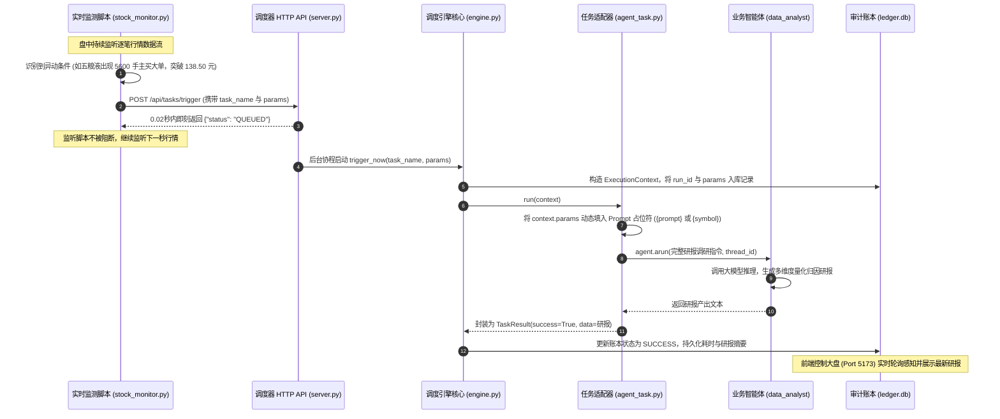

# MultiAgent 调度系统：脚本条件触发 Agent 与动态传参技术指南

本文档系统性阐述 MultiAgent 系统中**“实时监测脚本 ➔ 发现条件异动 ➔ 唤醒调度器 ➔ 启动 Agent 深度调研并传递参数”**的完整实现机制、数据流向与开发规范。

---

## 一、核心架构与协作模型

在量化投研与自动化盯盘系统中，通常存在两种截然不同的计算负载：
1. **轻量、连续、高频的监听脚本**：如盘口逐笔流水监听、技术指标计算，要求毫秒级响应、永不卡死、长时常驻运行。
2. **重量、深度、高价值的智能体 (Agent)**：如主力资金归因分析、宏观研报撰写，单次执行依赖大模型推理，耗时 15~40 秒，计算昂贵。

### 架构设计准则
- **脚本与 Agent 完全解耦**：监听脚本**不需要**引入 LangGraph 或大模型依赖，只通过标准 API 与调度器通信。
- **非阻塞即时响应**：脚本通知调度器的开销仅为 **0.02 秒**，绝不会因大模型耗时推理而阻塞实时的行情监听。
- **模板复用防膨胀**：全局保持单一固定的 Agent 任务模板，每次触发仅作为**执行流水（Run）**记录在审计账本中，绝不在任务大盘中动态堆叠冗余 Agent。

---

## 二、端到端数据流与控制流（时序图）



---

## 三、各阶段实现细节与源码剖析

### 1. 阶段一：监测脚本打包参数并发送（发起端）
在 [`workspace/scripts/stock_monitor.py`](file:///d:/Project/MultiAgent/workspace/scripts/stock_monitor.py) 中，当条件满足时组装参数，向调度器发送 HTTP 请求：

```python
import json
import urllib.request

def notify_scheduler_to_launch_agent(tick_data: dict) -> bool:
    """向调度器发送异步通知，拉起固定的分析 Agent (stock_anomaly_analyst) 开展调研"""
    prompt = (
        f"【实时异动盘中调研指令】\n"
        f"标的代码: {tick_data['symbol']} ({tick_data['name']})\n"
        f"成交价格: {tick_data['price']} 元 (突破阻力位 138.50 元)\n"
        f"单笔主买成交量: {tick_data['volume_lots']} 手 | 成交额: {tick_data['amount_cny']:,} 元\n"
        f"请作为资深投资分析师对该异动进行深度研判调研:\n"
        f"1. 归因主力资金意图 (主动抢筹建仓 vs 试盘抛压 vs 诱多出货);\n"
        f"2. 评估突破有效性与后市 5~15 分钟关键支撑压力位;\n"
        f"3. 给出针对持仓者与短线选手的具体应对策略与风险提示。"
    )

    # 触发已在 schedule.yaml 中固定声明的任务模板
    payload = {
        "task_name": "stock_anomaly_analyst",
        "params": {
            "prompt": prompt
        }
    }

    req_data = json.dumps(payload, ensure_ascii=False).encode("utf-8")
    req = urllib.request.Request(
        "http://127.0.0.1:8765/api/tasks/trigger",
        data=req_data,
        headers={"Content-Type": "application/json; charset=utf-8"}
    )
    with urllib.request.urlopen(req, timeout=5) as resp:
        return json.loads(resp.read().decode("utf-8")).get("success", False)
```

---

### 2. 阶段二：调度服务非阻塞接单（接口层）
在 [`backend/scheduler/server.py`](file:///d:/Project/MultiAgent/backend/scheduler/server.py) 中，服务端接收到请求后，立即包装为 `asyncio.create_task`，并在 0.02 秒内返回响应：

```python
@app.post("/api/tasks/trigger", response_model=ApiResponse)
async def trigger_task(req: TriggerTaskRequest):
    """立即在服务端触发一个已注册的任务"""
    if req.task_name not in scheduler.tasks:
        raise HTTPException(status_code=404, detail=f"未找到已注册任务: {req.task_name}")

    # 后台异步执行，绝不阻塞当前 HTTP 请求
    asyncio.create_task(scheduler.trigger_now(req.task_name, params=req.params))
    
    return ApiResponse(
        success=True,
        message=f"已下发执行任务: {req.task_name}",
        data={"task_name": req.task_name, "status": "QUEUED"},
    )
```

---

### 3. 阶段三：调度引擎上下文构建与审计（内核层）
在 [`backend/scheduler/engine.py`](file:///d:/Project/MultiAgent/backend/scheduler/engine.py) 中，调度器为本次运行分配全局唯一的 `run_id`，并将入参存入 SQLite 数据库：

```python
async def _execute_job_wrapper(self, task: BaseTask, params: Optional[Dict[str, Any]] = None):
    # 构造执行上下文
    context = ExecutionContext(
        task_name=task.name,
        params=params or {},  # 脚本传递的 {"prompt": "..."} 注入 context
        logger=logger,
    )

    # 记录到审计账本数据库 (TaskLedger)
    await self.ledger.record_start(
        run_id=context.run_id,
        task_name=task.name,
        task_type=task.task_type,
        params=context.params,
    )

    # 派发给任务实现对象执行
    result = await task.run(context)
    
    # 写入完成状态与研报文本
    await self.ledger.record_finish(
        run_id=context.run_id,
        status="SUCCESS" if result.success else "FAILED",
        result_data=result.data,
        duration_seconds=result.duration_seconds,
    )
    return result
```

---

### 4. 阶段四：参数注入与 Prompt 模板安全渲染（适配层）
在 [`backend/scheduler/tasks/agent_task.py`](file:///d:/Project/MultiAgent/backend/scheduler/tasks/agent_task.py) 中，`AgentTask` 将入参安全替换进提示词模板：

```python
async def run(self, context: ExecutionContext) -> TaskResult:
    # 1. 动态加载目标智能体
    agent = await load_agent(self.agent_name)

    # 2. 合并入参并安全格式化占位符
    format_vars = {**context.shared_data, **context.params}
    prompt = self.prompt_template
    # 精准替换 {key} 占位符，避免因 Prompt 内部包含 JSON 大括号而导致 KeyError
    for k, v in format_vars.items():
        prompt = prompt.replace(f"{{{k}}}", str(v))

    # 3. 异步启动 Agent 推理
    response = await agent.arun(prompt, thread_id=active_thread_id)
    return TaskResult(task_name=self.name, success=True, data=response)
```

---

## 四、配置规范：如何声明固定任务模板

在 [`workspace/schedules/schedule.yaml`](file:///d:/Project/MultiAgent/workspace/schedules/schedule.yaml) 中进行声明：

```yaml
schedules:
  # -----------------------------------------------------------------
  # 任务 1：个股盘口逐笔异动实时监测任务 (外部脚本)
  # -----------------------------------------------------------------
  - name: stock_price_monitor
    type: script
    script_path: "workspace/scripts/stock_monitor.py"
    description: "五粮液(000858.SZ) 盘口逐笔异动实时监测脚本"

  # -----------------------------------------------------------------
  # 任务 2：个股异动深度调研 Agent (固定任务，由监测脚本触发)
  # -----------------------------------------------------------------
  - name: stock_anomaly_analyst
    type: agent
    agent_name: data_analyst
    prompt: "{prompt}"   # 留空占位符，由脚本在触发时动态传入整段调研指令
    description: "个股异动深度分析 Agent (待命中，复用固定任务模板)"
```

### 设计要点对比：为什么禁止动态生成 Task？
| 方式 | 行为表现 | 带来的后果 | 推荐程度 |
| :--- | :--- | :--- | :--- |
| **错误做法：动态注册 Task** (`submit-agent`) | 每次触发调用 `register_task`，随机命名 `dynamic_agent_xxx` | 运行几小时后任务大盘堆积数百个废弃 Agent，界面杂乱卡顿 | ❌ 严禁在循环监听中使用 |
| **正确做法：复用固定 Task** (`trigger`) | 预先在 YAML 注册 `stock_anomaly_analyst`，每次触发调用 `/api/tasks/trigger` | 任务大盘永久保持仅 1 个该 Agent，每次触发只生成一条流水记录 | ✅ 生产标准实践 |

---

## 五、生产实践：实时监听脚本的防重复与冷却机制 (Debounce)

在真实的盘口实时流中，大额成交可能在几秒内连续发生多笔。为保护大模型 Token 成本，建议在监听脚本中加入**防重复触发与冷却时间（Cooldown）**：

```python
import time

LAST_ALERT_TIMESTAMPS = {}
COOLDOWN_SECONDS = 300  # 同一标的 5 分钟内最多触发 1 次深度调研

def should_trigger_alert(symbol: str) -> bool:
    now = time.time()
    last_time = LAST_ALERT_TIMESTAMPS.get(symbol, 0)
    if now - last_time < COOLDOWN_SECONDS:
        print(f"⏳ [{symbol}] 处于防抖冷却期内 ({int(now - last_time)}s / {COOLDOWN_SECONDS}s)，跳过重复调用 Agent。")
        return False
    LAST_ALERT_TIMESTAMPS[symbol] = now
    return True
```

---

## 六、验证方法与检查清单

1. **检查调度服务状态**：
   ```bash
   curl http://127.0.0.1:8765/health
   ```
2. **确认任务大盘中仅有固定模板**：
   ```bash
   curl http://127.0.0.1:8765/api/tasks
   # 预期应仅返回 stock_price_monitor 与 stock_anomaly_analyst 两项
   ```
3. **执行监测脚本测试触发**：
   ```bash
   uv run python workspace/scripts/stock_monitor.py
   ```
4. **查验调研报告产出流水**：
   ```bash
   curl http://127.0.0.1:8765/api/ledger?limit=1
   ```
5. **在 Web 大屏可视化查验**：
   打开浏览器访问 `http://localhost:5173/`，即可在前端大盘中直观查看 Agent 产出的 Markdown 深度调研研报。
